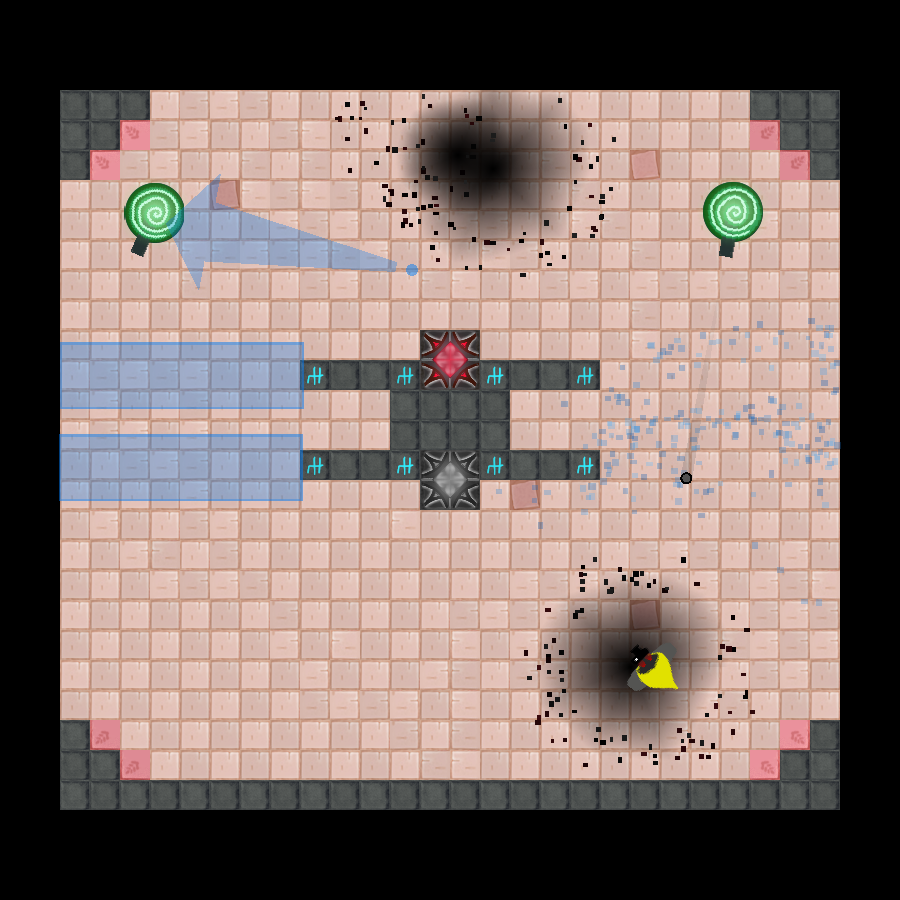

# Pictomage

A top-down 2D puzzle-shooter game. Made in 1 week for the [Raylib 5K gamejam](https://itch.io/jam/raylib-5k-gamejam). Play it from your browser on [itch.io](https://blatnik.itch.io/pictomage)!

  

## How to build (Web)

This all assumes you are using Windows 10. You will need the Emscripten SDK:

1. Go to the [emsdk github page](https://github.com/emscripten-core/emsdk).
2. Click on the green `Code` dropdown and then `Download ZIP`.
3. Extract the zip to a folder called `Emscripten`, and put that folder wherever you want.
4. In the start menu search bar, search for `path`. Then click on `Edit the system environment variables`.
5. In the `System variables` list, find the `Path` variable, select it, then click `Edit`.
6. Press `New`, and type out the path to the `Emscripten` folder (e.g. `C:\dev\Emscripten`).
7. Press `Ok` to close all the open windows.
8. To make sure everything worked, open up a new command prompt, and run `emsdk`. It should say `Missing command; Type 'emsdk help'..`
8. In the same command prompt, run `emsdk update` followed by `emsdk install latest`. 
9. You can now just run [`webbuild.bat`](./webbuild.bat) inside this project to build the game. The output goes into [`bin/web/`](./bin/web/).
10. Run [`webrun.bat`](./webrun.bat) to run the game in your browser.

## How to build (Windows - Visual Studio)

1. You need to download and install [Visual Studio 2022](https://visualstudio.microsoft.com/vs/).
2. When you need to select which components to install, make sure `Desktop development with C++` is ticked.
3. Open up [`Pictomage.sln`](./Pictomage.sln) in Visual Studio and click the run button at the top. The output goes into [`bin/x64/`](./bin/x64/)
